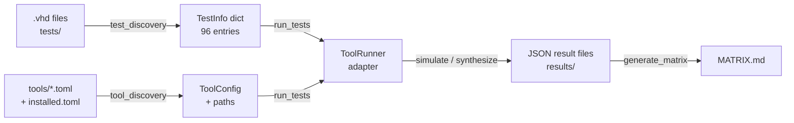

# Architecture & Design Notes

> For developers adding features, fixing bugs, or onboarding.
> Read this before touching the codebase.

---

## Data Flow: Test → Result → Matrix



1. **`test_discovery.py`** walks `tests/`, parses `-- FEATURE:`, `-- XREF:`, etc. from VHDL comment headers into `TestInfo` objects. Returns a dict keyed by `relative_path@mode`. No external manifest — filesystem is the index.

2. **`tool_discovery.py`** loads `tools/{name}.toml` (adapter configs: commands, flags) and `tools/installed.toml` (per-user paths, versions, aliases). Maps section names through `TOOL_ALIASES` (e.g., "Altera Questa Starter" → "questa").

3. **`run_tests.py`** — CLI entry. Resolves alias → version, creates the right `ToolRunner` subclass, iterates standards/modes, saves flat JSON files to `results/`.

4. **`vivado_adapter.py` / `questa_adapter.py`** — Subclass `ToolRunner`. Implement `simulate()` (compile + run) and optionally `synthesize()`. Use `_find_tool()` to locate binaries.

5. **`generate_matrix.py`** — Reads all JSON result files, builds combined comparison table. Three sections: main table, Vivado sim-vs-synth, UVVM appendix.

---

## Key Design Patterns

### Alias Resolution (`run_tests.py`)

```python
# 1. Parse installed.toml → DetectedTool objects with .alias field
# 2. Match --version against alias OR version string
# 3. Resolve alias to actual version BEFORE creating runner
# 4. Runner gets actual version string (not alias)
```

**Why before runner creation:** The runner stores `self.version` and `_find_tool()` uses it to find the correct binary. If the runner gets the alias string instead of the real version, version filtering breaks.

### Version-Aware Tool Discovery (`vivado_adapter.py`, `questa_adapter.py`)

Every `_find_tool()` method MUST filter by `self.version`:

```python
for dt in detected.get(tool_key, []):
    if dt.version != self.version:  # CRITICAL
        continue
    ...
```

**Bug fixed:** Before this check, `_find_tool` returned the first installed Vivado regardless of `--version`. All three Vivado versions were running the 2026.1 binary. This latent bug exists in every tool adapter — add the check when creating new adapters.

### Combined Results (Flat JSON)

Results are **not** split by standard. Each run produces one JSON file:
```
vivado-2026.1_sim.json    → 96 features across all 4 standards
vivado-2026.1_synth.json  → 93 synthesizable features
```

The `"standard"` field is `"combined"`. Each result entry has its own `"standard"` field (e.g., `"VHDL-2008"`). This avoids directory nesting and simplifies the matrix generator.

### Test Types (sim / synth / both)

Each test declares its type in the VHDL header:
- `TEST_TYPE: sim` — simulation only (e.g., `std.env.stop`)
- `TEST_TYPE: synth` — synthesis only (rare)
- `TEST_TYPE: both` — works in both modes

Matrix synth columns show **➖ N/A** for sim-only features, **⬜ not run** for untested.

---

## Tool-Specific Quirks

### Vivado (xvhdl / xelab / xsim)

| Issue | Detail |
|---|---|
| **xvhdl flags** | Only supports `--2008` and `--2019`. VHDL-2000/2002 → map to `--2008` |
| **Synthesis via Tcl** | Batch Tcl wrapper: `vivado -mode batch -source script.tcl`. Uses `read_vhdl -vhdl2008` / `-vhdl2019` |
| **Synthesis temp copies** | Must strip `use std.env.all` and cut at `TB_IMPORT` marker for synth-only entities |
| **Synthesis bugs fixed** | 6 bugs (wrong part, missing project, Tcl path nesting, missing std flag, std.env, TB errors) — see `tool-notes.md` |

### Questa / ModelSim (vcom / vsim)

| Issue | Detail |
|---|---|
| **Non-zero exit** | May return exit code 1 on success with notes/warnings. Check `** Error:` in output, not just exit code |
| **Lockfile spam** | Starter Edition floods stdout with lockfile messages. Filtered by adapter |
| **Library inheritance** | Each design unit needs its own `library ieee; use ...` — not inherited within same file |
| **Shared adapter** | Both use `questa_adapter.py`. Distinguished by `installed.toml` section name and path |

---

## installed.toml Format

Two formats coexist:

**List-of-tables** (multi-version tools like Vivado):
```toml
[["Vivado"]]
version = "2026.1"
alias = "v26"
path = "C:/Xilinx/2026.1/Vivado/bin"

[["Vivado"]]
version = "2023.2"
path = "C:/Xilinx/Vivado/2023.2/bin"
```

**Named section** (single-instance tools like Questa):
```toml
["Altera Questa Starter"]
version = "2025.3"
alias = "questa"
path = "C:/altera_pro/26.1/questa_fse/win64"
```

Both produce `DetectedTool` objects. The only difference is how TOML groups them.

---

## Adding a New Tool Adapter

1. Create `tools/{name}.toml` — specify paths, commands, flags
2. Create `scripts/{name}_adapter.py` — subclass `ToolRunner`
3. Implement `simulate()` — return `TestResult` with PASS/FAIL
4. Optionally implement `synthesize()` — return `TestResult`
5. Add to `TOOL_CLI` dict in `run_all.py`
6. **IMPORTANT:** `_find_tool()` must filter by `self.version`

Minimal adapter skeleton:
```python
class MyRunner(ToolRunner):
    def simulate(self, test, standard, work_dir):
        result = TestResult(...)
        exe = self._find_tool("my_exe")
        if not exe:
            result.status = TestStatus.UNTESTED
            return result
        # run exe, check output, set result.status
        return result
```

---

## Adding a New Test

1. Copy `tests/_TEMPLATE.vhd`
2. Fill metadata header:
   ```vhdl
   -- STD: VHDL-2019
   -- FEATURE: Short description — one-line summary
   -- CATEGORY: category_name
   -- XREF: LCS2016-XXX        # mandatory for VHDL-2019
   -- TEST_TYPE: sim            # sim, synth, or both
   ```
3. Write minimal self-checking testbench
4. Place in `tests/{standard}/{category}/`
5. **VHDL-2019 naming:** `{category}_lcs{number}_{feature}.vhd`
6. Run `python -m pytest scripts/tests/ -v` to verify discovery

---

## Performance Notes

| Component | Time | Notes |
|---|---|---|
| Vivado batch startup | 10-30s | One-time per invocation. `--mode both` saves a second startup |
| Questa compile per file | ~1-2s | 96 files × 1s = ~2 min for full sim |
| Vivado synth per file | ~5-10s | 39 files × 7s = ~5 min for full synth |
| Full `run_all.bat` | ~20 min | Questa sim + ModelSim sim + 3× Vivado sim+synth |
| Matrix generation | <1s | Pure Python, in-memory |

**Optimization:** `run_all.py` uses `--mode both` for Vivado (one `vivado -mode batch` startup instead of two). If you need to re-run a single version: `python scripts/run_all.py --tool vivado --version v25`.

---

## UTF-8 Output

The matrix uses Unicode symbols (✅❌⬜➖). The CLI output uses ASCII (`PASS`/`FAIL`) to avoid terminal encoding issues on Windows. Both are generated by the same `build_status_cell()` function.
